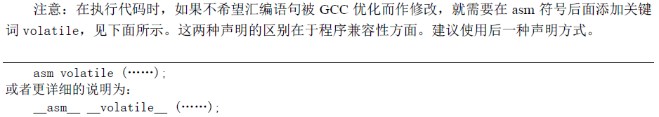
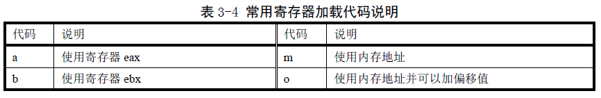
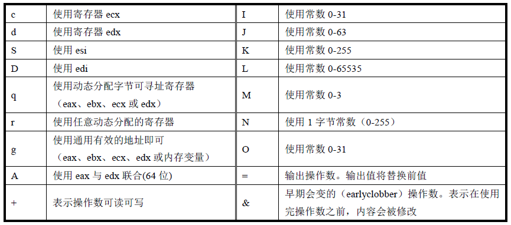
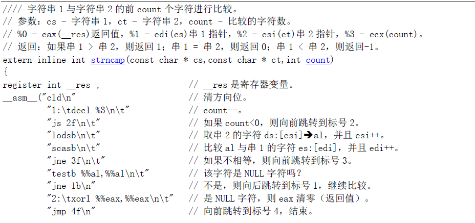
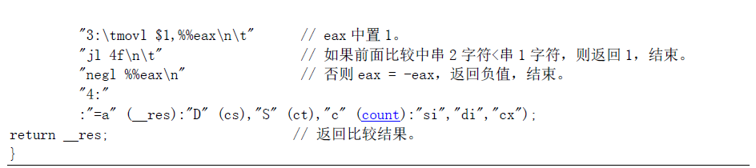
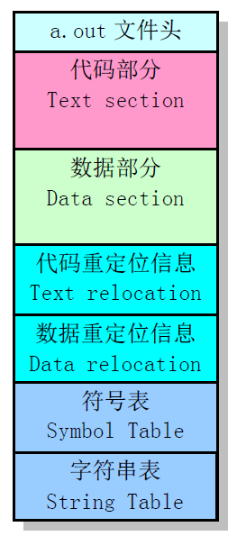
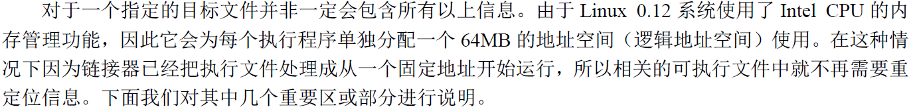

# 第3章 内核编程语言和环境

## 3.3.2 C语言中嵌入汇编语言

1. 基本格式

   \_\_asm\_\_(“汇编语句”
   ​	: 输出寄存器
   ​	: 输入寄存器
   ​	: 会被修改的寄存器);

   

   

   

2. 实例

   

   

3. **注意：最新的GCC规定输入或输出寄存器不能出现在可能被修改的寄存器中，目前看到网上的方法是把所有类似问题的可能被修改的寄存器全部删掉。**

## 3.5 Linux 0.12 目标文件格式

### 3.5.1 目标文件格式 a.out

