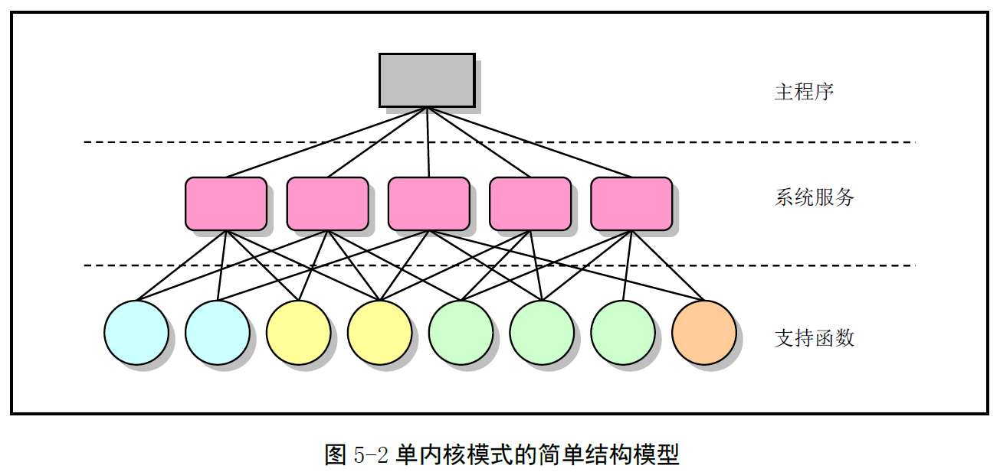
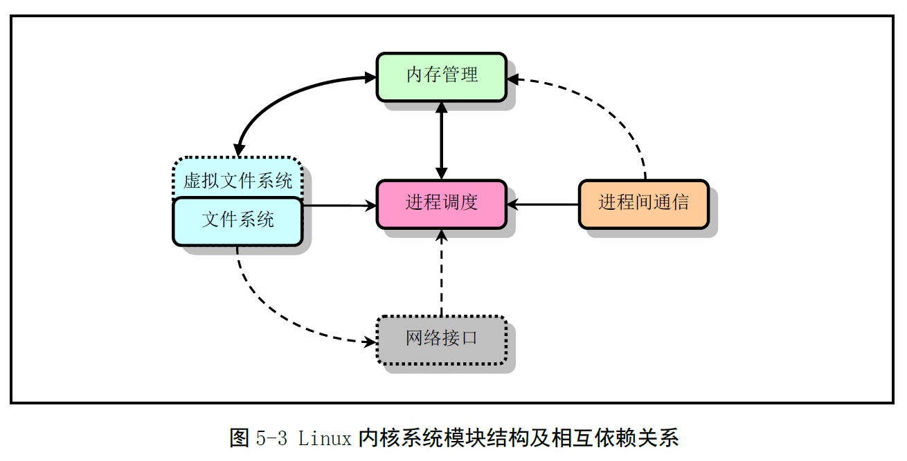
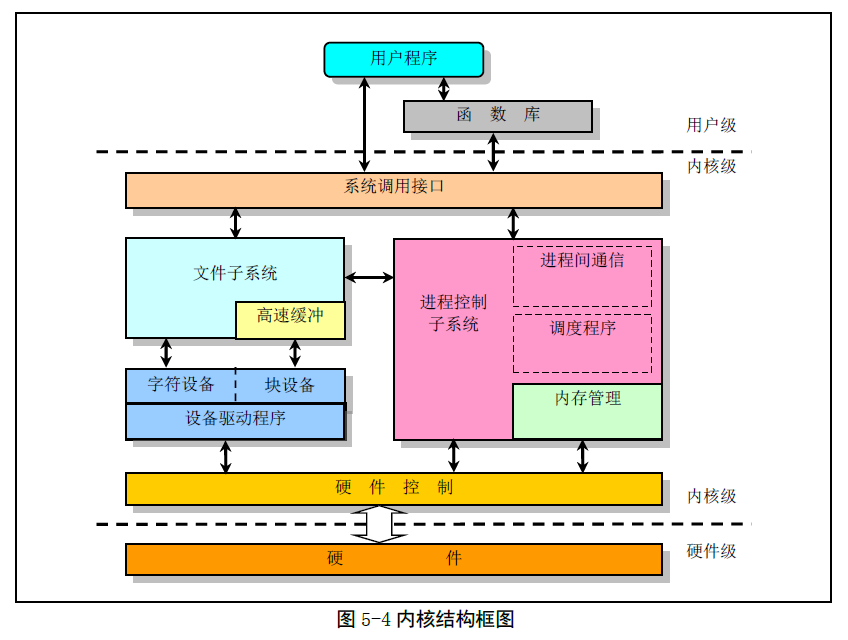

# 第五章 Linux内核系统体系结构

## Linux内核模式

Linux内核是单（宏）内核模式。

宏内核的优点是：内核代码紧凑、执行速度快。

缺点是：层次结构性不强，模块crach容易导致内核panic

## Linux内核系统体系结构

Linux内核主要由五个模块构成：

1. 进程调度模块
2. 内存管理模块
3. 文件系统模块
4. 进程间通信
5. 网络接口模块
    

一个页是4KB

一个页表目录项或页表项占用4B

一个页面放一个页目录或者页表

所以，一个页表中有1024个页表项；一个页目录表中有1024个页目录项。

一个页表可以表示1024*4KB=4MB的大小。

一个页目录表可以表示1024*4MB=4GB的大小。